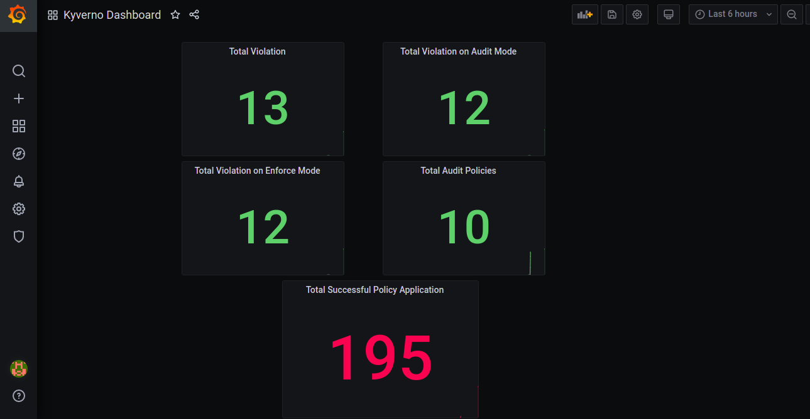

## Kyverno exporter

## Installation

```
kubectl apply -f 
```

## Metrics Support
- Total count of violations
- Number of violations on audit mode
- Number of violations of blocked resources (enforce mode)
- Total count of successful policy application
- Number of audit policies

## Screenshot

